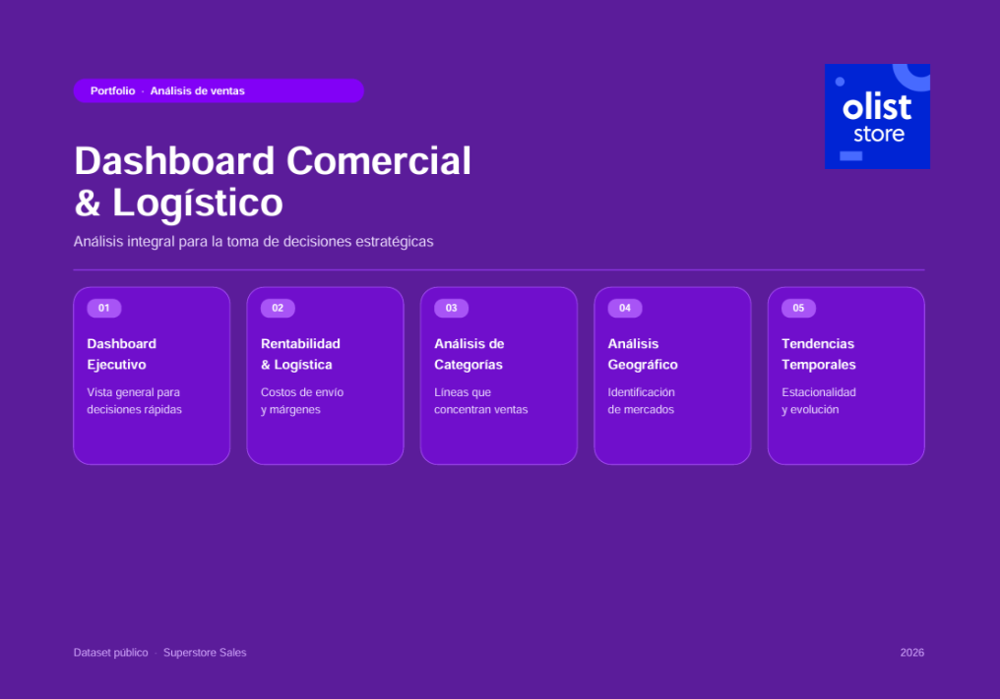

# 📊 Executive Sales Dashboard

An end-to-end Sales Analytics project built with **Python (Pandas)** and **Looker Studio**.

---

## 📌 Project Overview

This project demonstrates a complete data analytics workflow, from raw transactional data to an interactive executive dashboard.

The dataset was cleaned, transformed and enriched using Python before being visualized in Looker Studio.

---

## 🚀 Technologies

- Python
- Pandas
- NumPy
- Looker Studio
- Git
- GitHub

---

## 📂 Dataset

Brazilian E-Commerce Public Dataset (Olist)

https://www.kaggle.com/datasets/olistbr/brazilian-ecommerce

---

## ⚙️ Data Preparation

The Python pipeline includes:

- Data cleaning
- Missing value handling
- Table joins
- Category translation
- Feature engineering
- Date transformation
- Sales calculations
- Export of a reporting dataset for Looker Studio

---

## 📈 Dashboard KPIs

- 💰 Total Sales
- 📦 Total Orders
- 🌎 Geographic Coverage
- 🛒 Average Order Value

---

## 🖥️ Dashboard Preview



---

## 📁 Project Structure

```text
python-sales-dashboard/
│
├── dashboard/
│   ├── dashboard_preview.png
│   └── logo.png
│
├── data/
│   └── olist_looker.csv
│
├── src/
│   └── olist_dashboard.py
│
├── requirements.txt
├── README.md
└── LICENSE
```

---

## 🔗 Interactive Dashboard

**Looker Studio**

(https://datastudio.google.com/s/hG3najsVXFM)

---

## 👩‍💻 Author

**Daniela Itriago**

Data Analytics • Python • SQL • Power BI • Looker Studio
